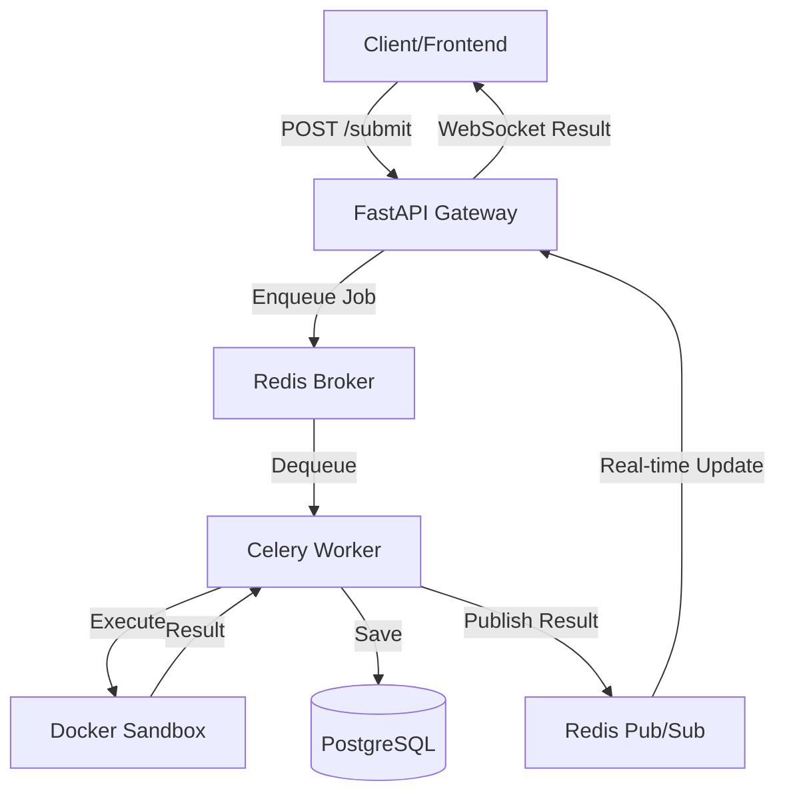

# 🚀 Remote Code Execution Engine & Online Judge

A highly secure, asynchronous Remote Code Execution (RCE) engine and Online Judge platform, built for performance, isolation, and developer experience.

[](https://www.python.org/)
[](https://fastapi.tiangolo.com/)
[](https://www.docker.com/)
[](https://docs.celeryq.dev/)
[](https://redis.io/)
[](https://www.postgresql.org/)
[](https://nextjs.org/)

---

## 📖 Overview

This platform provides a robust environment for executing user-submitted code across multiple languages. It features a fully decoupled architecture using **FastAPI** for the gateway, **Celery** for background processing, and **rootless Docker** for secure sandboxing.

### Key Features
- **🔒 Secure Sandboxing**: Submissions run in rootless Docker containers with `seccomp` allowlists, read-only filesystems, and zero network access.
- **⚡ Asynchronous Processing**: Scalable task queue management using Celery and Redis.
- **🛰️ Real-time Updates**: WebSocket integration for instant submission results.
- **📊 Comprehensive Monitoring**: Liveness/readiness checks and persistent submission logs.
- **🌍 Multi-language Support**: Python, C++, Java, and Node.js out of the box.
- **🛡️ Rate Limiting**: Token bucket and sliding window limiters to prevent abuse.

---

## 🏗️ Architecture

The platform is designed to be highly scalable and resilient. Below is the high-level flow of a code submission:



| Component | Technology | Role |
| --- | --- | --- |
| **API Gateway** | FastAPI | HTTP endpoints, WebSocket hub, rate limiting, and authentication. |
| **Message Broker**| Redis (DB 0) | Task queueing and Pub/Sub delivery. |
| **Result Backend**| Redis (DB 1) | Storage for Celery task results. |
| **Worker Engine** | Celery + Beat | Background evaluation and periodic maintenance (zombie cleanup). |
| **Primary DB**    | PostgreSQL | Persistent storage for problems, test cases, and submissions. |
| **Sandbox**       | Docker | Rootless containers with strict CPU/Memory/PID limits. |

---

## 📂 Project Structure

```text
.
├── api/                # FastAPI application logic and routes
├── auth/               # Authentication handlers and JWT dependencies
├── config/             # Pydantic settings and environment management
├── db/                 # Database models, migrations, and session management
├── docker/             # Dockerfiles for sandbox environments (cpp, java, etc.)
├── docs/               # System design diagrams and ERDs
├── frontend/           # Next.js web interface
├── infra/              # Infrastructure configs (seccomp, etc.)
├── rate_limit/         # Rate limiting implementations (Token Bucket, Sliding Window)
├── scripts/            # Utility scripts (OpenAPI gen, DB seeding, migrations)
├── shared/             # Shared enums and Pydantic models
├── worker/             # Celery worker logic and sandbox orchestration
├── docker-compose.yml  # Full-stack orchestration
└── pyproject.toml      # Backend dependencies and project metadata
```

---

## 🚀 Getting Started

### Prerequisites
- **Python**: 3.10+
- **Node.js**: 20+ (for frontend)
- **Docker**: 24.x+ (Rootless mode recommended for production)
- **PostgreSQL & Redis**: (Provided via Docker Compose)

### 1. Backend Setup
```bash
# Clone the repository
git clone <repo-url>
cd remote-code-execution-engine

# Create virtual environment
python -m venv .venv
source .venv/bin/activate  # Windows: .venv\Scripts\activate

# Install dependencies
pip install -e ".[dev]"

# Configure environment
cp .env.example .env
# Update .env with your secrets (DATABASE_URL, JWT_SECRET, etc.)
```

### 2. Frontend Setup
```bash
cd frontend
npm install
cp .env.example .env
# Update .env with NEXT_PUBLIC_API_URL=http://localhost:8000
```

### 3. Running with Docker (Quick Start)
```bash
# Build sandbox images
bash scripts/build_images.sh

# Start everything
docker-compose up --build
```

---

## 🛠️ Development Workflow

### Database Migrations
```bash
# Run migrations
bash scripts/migrate.sh
# or
python -m alembic upgrade head
```

### Generating OpenAPI Schema
```bash
# Generate the latest openapi.json
python scripts/generate_openapi.py
```

### Running Tests & Linting
```bash
# Linting & Formatting
ruff check .
ruff format .

# Type Checking
mypy .
```

---

## ⚙️ Environment Variables

All variables are read via `config/settings.py` (Pydantic BaseSettings). See `.env.example` for the full list.

| Variable | Default | Description |
| --- | --- | --- |
| `DATABASE_URL` | — | Async PostgreSQL DSN. |
| `REDIS_URL` | `redis://localhost:6379/0` | Broker, pub/sub, rate-limit counters. |
| `JWT_SECRET` | — | HS256 signing secret. |
| `ALLOWED_ORIGINS` | `["http://localhost:3000"]` | JSON-encoded list of allowed origins. |
| `SANDBOX_BASE_DIR`| `/sandbox/jobs` | Host path for sandbox jobs. |

---

## 🔌 API Reference

Full interactive documentation is available at `/docs` when the API is running.

- **`POST /submit`**: Submit code for evaluation.
- **`GET /submissions/{job_id}`**: Poll submission status.
- **`WS /ws/{job_id}`**: Real-time result streaming via WebSockets.
- **`GET /problems`**: List available challenges.

For Fern-generated documentation and SDKs, visit: [rce-docs.buildwithfern.com](https://rce-docs.docs.buildwithfern.com)

---

## 🚦 Verdict Reference

| Verdict | Meaning |
| --- | --- |
| `ACC` | Accepted — all test cases passed. |
| `WA` | Wrong Answer — output mismatch. |
| `TLE` | Time Limit Exceeded. |
| `MLE` | Memory Limit Exceeded. |
| `RE` | Runtime Error — non-zero exit code. |
| `CE` | Compilation Error — failed to build artifact. |
| `IE` | Internal Error — sandbox or worker failure. |

---

## ➕ Adding a New Language

1. **Create Dockerfile**: Add `docker/<lang>/Dockerfile` following the standard pattern.
2. **Register Runner**: Update `worker/runners.py` with the language's compile and run commands.
3. **Update Enum**: Add the new language to `shared/enums.py`.
4. **DB Migration**: Create an Alembic migration to update the `language_enum` in PostgreSQL.
5. **Fairness Multipliers**: (Optional) Add time/memory multipliers in `worker/fairness.py`.

---

## 🔒 Security & Isolation

The engine employs multiple layers of security to prevent malicious code from impacting the host:
- **Rootless Docker**: The worker and sandbox containers do not have root privileges on the host.
- **Seccomp**: A strict system call filter restricts the capabilities of the running code.
- **Networking**: All sandbox containers are disconnected from any network.
- **Resource Limits**: Hard caps on memory (e.g., 256MB), CPU shares, and number of processes (PIDs).
- **Filesystem**: The sandbox environment is mounted as read-only, except for a temporary working directory.

---

## 🚀 Deployment

The project includes a GitHub Actions workflow for automated deployment to a DigitalOcean Droplet.

### CI/CD Pipeline
Whenever you push to the `main` branch, the pipeline will:
1. **Detect Changes**: Identifies if database models, migrations, or sandbox Dockerfiles have changed.
2. **Conditional DB Reset**: If database-related changes are detected, it drops Docker volumes (`postgres_data`), rebuilds the database, and runs the seed script.
3. **Sandbox Rebuild**: If sandbox source files change, it rebuilds the language-specific images on the droplet.
4. **Zero-Downtime Update**: Updates the application containers with the latest code.

### Required GitHub Secrets
To enable the pipeline, add the following secrets to your GitHub repository (**Settings > Secrets and variables > Actions**):

| Secret | Description |
| --- | --- |
| `DROPLET_IP` | The public IP address of your DigitalOcean droplet. |
| `DROPLET_USER` | The SSH username (usually `root`). |
| `DROPLET_SSH_KEY` | (Recommended) The private SSH key for the droplet. |
| `DROPLET_PASSWORD` | (Alternative) The root password for the droplet. |
| `PROJECT_PATH` | The absolute path to the project on the droplet (e.g., `/root/remote-code-execution-engine`). |

---

## ⚖️ License

This project is licensed under the MIT License - see the [LICENSE](LICENSE) file for details.
