# Technical Requirements Document (TRD)
## CodeSpace - Online Judge Platform

**Version:** 1.0  
**Last Updated:** May 11, 2026  
**Status:** Implementation-Ready

---

## Table of Contents

1. [Overview](#1-overview)
2. [System Architecture](#2-system-architecture)
3. [Core Components](#3-core-components)
4. [API Endpoints](#4-api-endpoints)
5. [Execution Pipeline](#5-execution-pipeline)
6. [AI-Powered Code Tutor](#6-ai-powered-code-tutor)
7. [Database Schema](#7-database-schema)
8. [Security & Isolation](#8-security--isolation)
9. [Deployment](#9-deployment)

---

## 1. Overview

CodeSpace is an online judge platform that safely executes untrusted user code in isolated environments. It provides:
- Secure code execution with strict resource limits
- Real-time feedback via WebSocket
- Support for Python, C++, Java, Node.js
- Scalable async architecture using Celery and Redis

---

## 2. System Architecture


📄 [View CodeSpace System Design.png](CodeSpace%20System%20Design.png)

The system consists of the following interconnected components:

- **Frontend (Next.js)** → Communicates with API via HTTP/WebSocket
- **API Gateway (FastAPI)** → Exposes endpoints, handles authentication, rate limiting, manages real-time connections
- **Message Broker (Redis)** → Queues code execution tasks, enables Pub/Sub for real-time result delivery
- **Database (PostgreSQL)** → Persistent storage for users, problems, submissions, test cases
- **Worker (Celery)** → Processes queued tasks, orchestrates Docker containers, captures results
- **Sandbox (Docker)** → Isolated code execution environment with strict resource limits and security policies

### Component Roles

| Component | Technology | Purpose |
|-----------|-----------|---------|
| **API Gateway** | FastAPI | HTTP endpoints, WebSocket hub, JWT auth, rate limiting |
| **Task Queue** | Redis (DB 0) + Celery | Asynchronous job queuing and execution |
| **Pub/Sub** | Redis (DB 0) | Real-time result delivery to WebSocket clients |
| **Database** | PostgreSQL | Persistent storage (users, problems, submissions, test cases) |
| **Worker** | Celery + Beat | Dequeue tasks, orchestrate Docker, store results |
| **Sandbox** | Docker (Rootless) | Isolated code execution with resource caps |

---

## 3. Core Components

### 3.1 FastAPI Gateway

**Responsibilities:**
- HTTP API endpoints for code submission and status checking
- WebSocket server for real-time result delivery
- JWT authentication and authorization
- Rate limiting (token bucket + sliding window)
- Request validation and response formatting

**Key Endpoints:**
- `POST /submit` — Submit code for execution
- `GET /submissions/{job_id}` — Poll submission status
- `WS /ws/{job_id}` — Real-time result stream
- `GET /problems` — List available problems
- `GET /health/live` — Liveness probe
- `GET /health/ready` — Readiness probe

### 3.2 Redis Broker

**Two-database setup:**
- **DB 0:** Celery task queue, Pub/Sub channels, rate-limit counters
- **DB 1:** Celery result backend (task results with TTL)

**Purpose:**
- Decouples API from Workers (API returns immediately, worker processes async)
- Enables horizontal scaling (multiple workers consume from same queue)
- Delivers results in real-time via Pub/Sub

**Data Flow:**
```
API enqueues → Redis Task Queue → Worker dequeues
                      ↓
               Worker processes
                      ↓
              Worker publishes → Redis Pub/Sub → API broadcasts to WebSocket
```

### 3.3 Celery Worker

**Responsibilities:**
- Poll Redis task queue for jobs
- Read problem details from PostgreSQL
- Spawn Docker container with submission code
- Capture output and compare against test cases
- Determine verdict (ACC, WA, TLE, MLE, RE, CE, IE)
- Store results in PostgreSQL
- Publish results to Redis Pub/Sub for real-time delivery

**Celery Beat (Scheduler):**
- Runs periodic tasks (e.g., zombie container cleanup)
- Can trigger batch operations

### 3.4 Docker Sandbox

**Container Configuration:**
- **User:** Non-root (uid=1000, gid=1000)
- **Network:** `--network=none` (no external access)
- **Filesystem:** Read-only root, temp `/tmp` for output
- **CPU:** 1 core limit (`--cpus=1`)
- **Memory:** 256 MB limit (`--memory=256m`)
- **PIDs:** 256 limit (`--pids-limit=256`)
- **Security:** Seccomp allowlist (see [infra/seccomp.json](../infra/seccomp.json))

**Execution Modes:**
- **Python:** Direct execution (`python3 code.py`)
- **C++:** Compile then execute (`clang++ -o binary code.cpp && ./binary`)
- **Java:** Compile then execute (`javac Main.java && java Main`)
- **Node.js:** Direct execution (`node code.js`)

---

## 4. API Endpoints

### 4.1 POST /submit

**Request:**
```json
{
  "problem_id": "uuid",
  "language": "python",
  "code": "print('Hello')"
}
```

**Response (202 Accepted):**
```json
{
  "job_id": "uuid"
}
```

### 4.2 GET /submissions/{job_id}

**Response (200 OK):**
```json
{
  "job_id": "uuid",
  "status": "completed",
  "verdict": "ACC",
  "execution_time_ms": 45,
  "memory_used_mb": 12.5,
  "stdout_snippet": "output",
  "stderr_snippet": ""
}
```

### 4.3 WS /ws/{job_id}?token={jwt}

**Connection:** WebSocket authenticated with JWT

**Messages from Server:**
```json
{
  "type": "subscription_confirmed",
  "job_id": "uuid"
}
```

```json
{
  "type": "submission_complete",
  "data": {
    "status": "completed",
    "verdict": "ACC",
    "execution_time_ms": 45,
    "memory_used_mb": 12.5,
    "stdout_snippet": "output",
    "stderr_snippet": ""
  }
}
```

---

## 5. Execution Pipeline

### 5.1 Submission Lifecycle

```
1. Client submits code
   ↓
2. API validates & rate-limits
   ↓
3. API creates submission record (status=pending)
   ↓
4. API enqueues Celery task
   ↓
5. Worker dequeues task
   ↓
6. Worker updates status=running
   ↓
7. Worker spawns Docker container
   ↓
8. Container compiles (if needed) & executes
   ↓
9. Worker captures output & compares test cases
   ↓
10. Worker determines verdict & updates DB
   ↓
11. Worker publishes result to Pub/Sub
   ↓
12. API broadcasts to connected WebSocket clients
```

### 5.2 Verdict Determination

| Scenario | Verdict |
|----------|---------|
| All test cases pass | ACC |
| Any test case fails (output mismatch) | WA |
| Execution exceeds time limit | TLE |
| Memory exceeds limit | MLE |
| Program crashes (exit ≠ 0) | RE |
| Compilation/transpilation fails | CE |
| Sandbox/worker/system error | IE |

---

## 6. AI-Powered Code Tutor

CodeSpace integrates an AI-powered coding tutor that provides real-time guidance to users:

### 6.1 Architecture

- **Frontend Panel** ([AIAgentPanel.tsx](../frontend/src/app/problems/%5Bid%5D/AIAgentPanel.tsx)) — Interactive chat interface in the problem editor
- **Guardrail Agent** ([agent.py](../api/agent.py)) — Filters out non-coding requests before processing
- **Coding Tutor Agent** — LLM-powered assistant that analyzes code and provides Socratic guidance
- **MCP Server** ([mcp-server/main.py](../mcp-server/main.py)) — Tool execution platform for editor integration and execution state access

### 6.2 Features

- **Code Analysis** — The tutor examines user code and identifies logical errors
- **Interactive Highlighting** — Uses `emit_editor_annotation` MCP tool to highlight problematic lines in the editor with hover tooltips
- **Socratic Questioning** — Guides users through debugging without providing direct solutions
- **Execution Context** — Accesses test case results via `fetch_execution_state` MCP tool to provide relevant feedback
- **Input Validation** — Guardrail agent ensures all requests are programming-related

### 6.3 Data Flow

```
User submits question
        ↓
Frontend sends via WebSocket (/ws/analyze)
        ↓
Guardrail Agent (input_guardrail)
        ↓
If allowed: Coding Tutor Agent processes with MCP tools
        ↓
MCP Tool Calls:
  - emit_editor_annotation → Redis Pub/Sub
  - fetch_execution_state → Redis cache
        ↓
Agent response streamed back to frontend
        ↓
Frontend renders markdown + editor highlights
```

### 6.4 Implementation Details

- **Model:** OpenRouter API (configurable via `OPEN_ROUTER_MODEL` env var)
- **Protocol:** Server-Sent Events (SSE) via `/ws/analyze` WebSocket
- **Cache:** Session state stored in Redis with hash-based code versioning
- **Integration:** Chat history tracked per session; line numbers injected into code for accuracy

---

## 7. Database Schema

**Key Tables:**
- **users** — User accounts, authentication
- **problems** — Problem definitions with time/memory limits
- **test_cases** — Input/output pairs for testing
- **submissions** — Submission records with results
- **topics** — Problem categories
- **problem_language_configs** — Language-specific boilerplate

**Enums:** See [shared/enums.py](../shared/enums.py) for Language, SubmissionStatus, Verdict

**Full Schema Diagram:**



📄 [View ERD.svg](ERD.svg) | [View Mermaid Source](db-erd.mmd)

---

## 8. Security & Isolation

### 8.1 Process Isolation
- Each submission runs in a separate Docker container
- No process can access other submissions' data
- Containers are destroyed immediately after execution

### 8.2 Network Isolation
- Containers have no network access (`--network=none`)
- No external I/O, localhost only
- Prevents exfiltration of data

### 8.3 Filesystem Isolation
- Root filesystem is read-only
- Only `/tmp` is writable (for output capture)
- No access to host files

### 8.4 Resource Limits
- **CPU:** 1 core (prevents CPU hogging)
- **Memory:** 256 MB (prevents memory bombs)
- **PIDs:** 256 processes (prevents fork bombs)
- **Timeout:** Per problem `time_limit_ms` (prevents infinite loops)

### 8.5 Seccomp Profile
A restrictive system call filter blocks dangerous operations like:
- `ptrace` (process tracing)
- `socket` (network operations)
- `fork` (process creation)

See [infra/seccomp.json](../infra/seccomp.json) for the complete allowlist.

---

## 9. Deployment

### 9.1 Docker Compose

**Services:**
- `api` — FastAPI (port 8000)
- `worker` — Celery worker + Beat
- `postgres` — Database
- `redis` — Broker
- `frontend` — Next.js (port 3000)

### 9.2 Environment Variables

| Variable | Default | Purpose |
|----------|---------|---------|
| `DATABASE_URL` | — | PostgreSQL connection string |
| `REDIS_URL` | `redis://redis:6379/0` | Redis broker |
| `JWT_SECRET` | — | JWT signing secret |
| `ALLOWED_ORIGINS` | `["http://localhost:3000"]` | CORS whitelist |
| `OPEN_ROUTER_API_KEY` | — | OpenRouter API key for AI agent |
| `OPEN_ROUTER_BASE_URL` | — | OpenRouter API base URL |
| `OPEN_ROUTER_MODEL` | — | LLM model to use for tutoring |

### 9.3 Database Migrations

```bash
# Apply latest migrations
alembic upgrade head

# Create new migration
alembic revision --autogenerate -m "description"
```

---

## Appendix: Key Files

- **[db/models.py](../db/models.py)** — SQLAlchemy database models
- **[api/main.py](../api/main.py)** — FastAPI application entry point
- **[worker/tasks.py](../worker/tasks.py)** — Celery task definitions
- **[shared/enums.py](../shared/enums.py)** — Language, Verdict, Status enums
- **[infra/seccomp.json](../infra/seccomp.json)** — Seccomp security profile
- **[docker-compose.yml](../docker-compose.yml)** — Service orchestration

---

**Document Version:** 1.0 | **Last Updated:** May 11, 2026 | **Status:** Implementation-Ready
